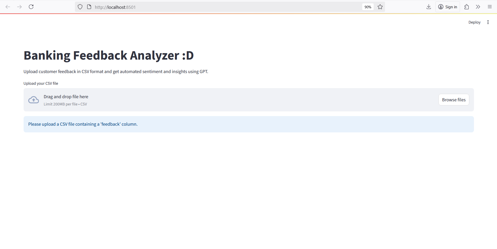
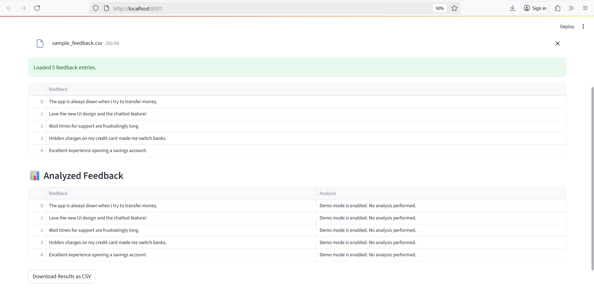

# Banking Feedback Analyzer with GPT

This project is a simple prototype for analyzing customer feedback in the banking sector using OpenAI's GPT model.
It allows users to upload a CSV file of feedback, which is then processed to classify sentiment, extract key issues, and summarize each entry.

## Live Demo
You can Try it here : [https://banking-feedback-analyzer-3onwbxjwpsvq7jaqyznki5.streamlit.app](https://banking-feedback-analyzer-3onwbxjwpsvq7jaqyznki5.streamlit.app)

### Features

- Upload CSV of customer feedback
- GPT classifies sentiment (positive, neutral, negative), extracts key issues, and summarizes each entry
- View results inside the app and download annotated feedback as CSV
- Demo mode available if OpenAI API key is missing

### Tech Stack

- Python
- Streamlit
- OpenAI GPT-3.5 API
- Pandas

### How to Run

1. Install requirements: `pip install -r requirements.txt`
2. Set your OpenAI API key:
   - In terminal: `export OPENAI_API_KEY=your-key`
   - In PowerShell (Windows): `setx OPENAI_API_KEY your-key`
3. Run the app:
   ```
   streamlit run app.py
   ```

### Sample Output

| Feedback                  | Analysis                                                                                           |
| ------------------------- | -------------------------------------------------------------------------------------------------- |
| The app is always down... | Sentiment: Negative<br>Key Issue: App reliability<br>Summary: Frequent app crashes frustrate user. |

---

Inspired by the Generative AI Challenge – use case: Feedback Analysis in Banking.

## Demo Screenshot

### Uploading


### Showing Summary



